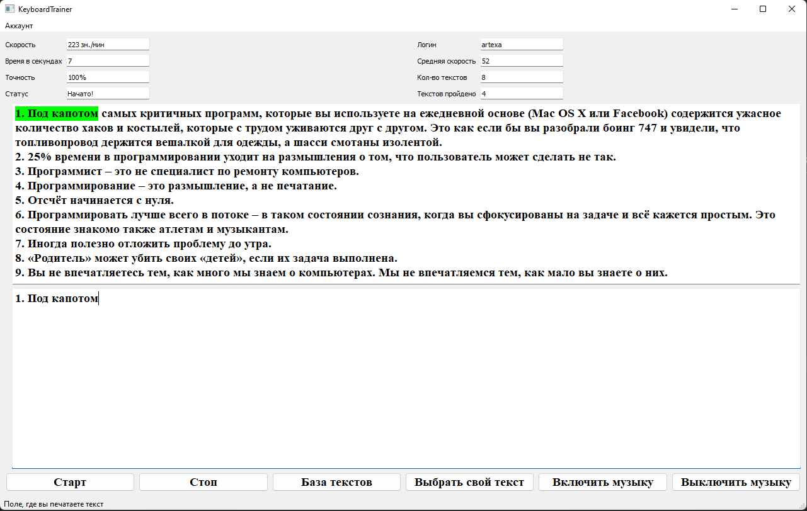

# Клавиатурный тренажёр

Версия 0.2

Автор: Артём Романов (artem.romanov.03@bk.ru)

Ревью выполнили:

## Описание

Данное приложение является реализацией программы
"Клавиатурный тренажёр" со статистикой, выбором своих текстов и музыки

## Требования

* Python версии не ниже 3.6 (используется 3.10.2)
* PyQT версии 5 или выше (используется 5.15.7)
* pygame версии 2 или выше (используется 2.1.2)

## Состав

* Запуск приложения: `keyboardtrainer.py`
* Модули: `modules/`
* Музыка: `music/`
* Тексты: `texts/`
* Пользователи: `users/`
* Работа с файлами: `modules/data.py`
* UI: `modules/UI.py`
* Логика приложения: `modules/logic.py`
* Работа с графическим интерфейсом: `modules/mainWindow.py`
* Проверка логина: `modules/validator.py`

## Графическая версия

Пример запуска: `python keyboardtrainer.py`

## Подробности реализации

Модули, отвечающие за работу и логику приложения, расположены в
пакете `modules`. В основе лежит класс `MainWindow`, класс `UiMainWindow`
отвечает за графический интерфейс, класс `GameLogic` отвечает за логику
приложения, функции в `data.py` отвечают за работу с файлами, метод
в `validator` - за валидность логина.

## Реализовано

- Динамическая статистика во время процесса
- Статистика для каждого пользователей с сохранением по логину
- Выбор музыки и добавление своей
- Выбор текстов и добавление своих текстов
- Встроенная база текстов
- Подсветка набираемого текста

### Фиксы

- Readme дополнен
- поле "Никнейм" переименовано в "Имя пользователя" (здесь отображается текущий
  пользователь)
- названия "game" переименованы

# Интерфейс

